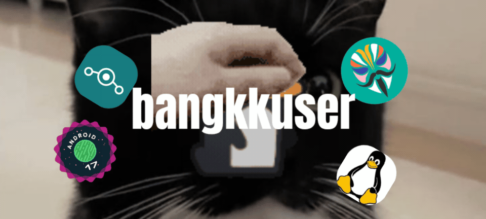

---

---

## Hi there👋

I am bangkkuser, and my focus is....

- Technology
- Android, AOSP
- Magisk Modules
- Phones
- And more!

---

## My projects for you _and all people._

### androidneko
https://github.com/rebangkkuser/androidneko

A lightweight and efficient Magisk module that cleans RAM and optimizes the device WITH THE PRESS OF A BUTTON. No frills of automatic execution, you know this could... break something.

Licensed under GNU GPL v3

---

### DozePlus
https://github.com/rebangkkuser/DozePlus

A lightweight Magisk module that gives Android Doze a slight boost and also closes background apps with just ONE click.

Licensed under GNU GPL v3
